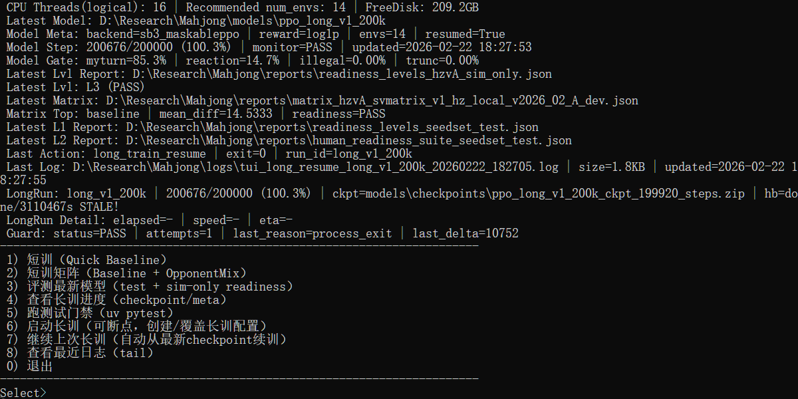
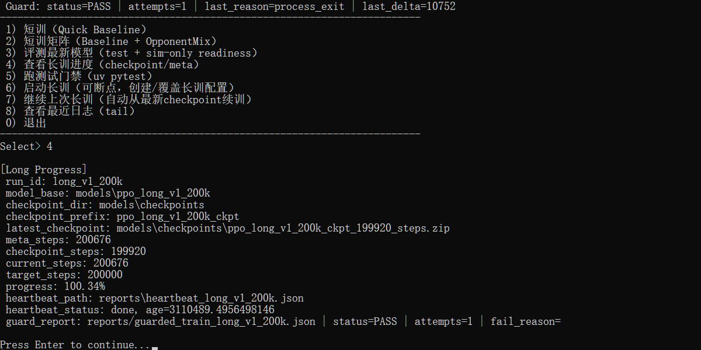
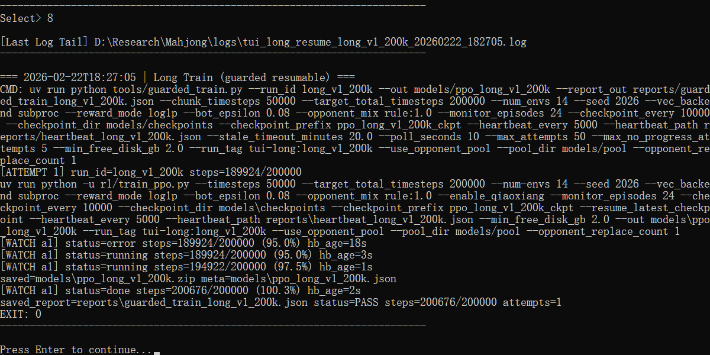

# Hangzhou Mahjong AI (MVP)

English documentation for this repository.  
Chinese version: [README-cn.md](./README-cn.md)

## Project Status

This is a **work-in-progress (WIP)** project for a four-player Hangzhou Mahjong AI pipeline.

Current focus:
- Rule engine and environment stability
- BC warm start from synthetic data
- MaskablePPO fine-tuning
- Duplicate evaluation with fixed seeds and seat rotation

Active alpha repository for a reproducible Hangzhou Mahjong AI pipeline, intended for public inspection, iteration, and contributor onboarding rather than production deployment.

## Roadmap

- `v0.0.x alpha`: keep the repo public-ready, stable to clone, and easy to inspect
- `v0.1.0`: make the train/eval loop reproducible on a clean machine
- `v0.2.0`: improve rule coverage, evaluation reporting, and benchmark clarity
- `v0.3.0`: strengthen the frontend demo, API usability, and contributor workflow

## Known Limitations

- Real-world validation is incomplete; the current status is still below a strong real-human-play claim
- Rule coverage is focused on the current Hangzhou Mahjong MVP profile, not full regional rule breadth
- Public releases do not include large generated artifacts such as trained models, reports, or datasets
- Evaluation evidence is stronger in duplicate/sim settings than in real gameplay settings
- The frontend is a showcase/demo layer, not a full product UI

## Screenshots

Homepage UI:



Training progress panel:



Recent logs panel:



## Repository Layout

- `api/` FastAPI backend endpoints
- `datasets/` data generation and replay tools
- `docs/` architecture/runbook/frontend notes
- `frontend/` Vue + Vite demo page
- `rl/` training and evaluation scripts
- `rules/` local rule profiles and configs
- `tests/` regression and gate tests
- `tools/` helper scripts (training guard, cleanup, TUI)

Generated artifacts are ignored by default (`models/`, `logs/`, `reports/`, `datasets/artifacts/`, etc.).

## Quick Start

### 1) Environment

```powershell
uv venv .venv --python 3.11 --managed-python
uv pip install --python .venv/Scripts/python.exe -r requirements.txt
```

### 2) Run tests

```powershell
uv run pytest tests -q
```

### 3) Start backend API

```powershell
uv run uvicorn api.server:app --host 127.0.0.1 --port 8000
```

### 4) Start frontend (optional)

```powershell
cd frontend
npm install
npm run dev
```

## Notes for Public Repo

- License: GNU General Public License v3.0 (`LICENSE`)
- Large/generated local artifacts are intentionally excluded via `.gitignore`
- If you need reproducible results, regenerate artifacts locally with the provided scripts

